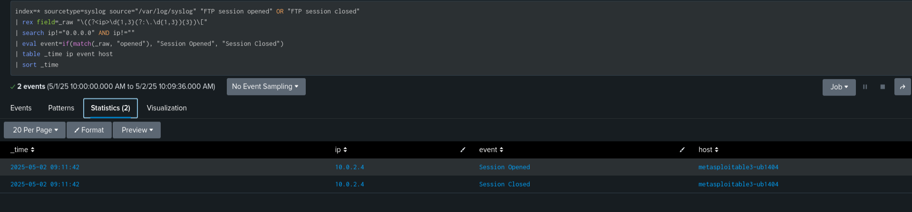
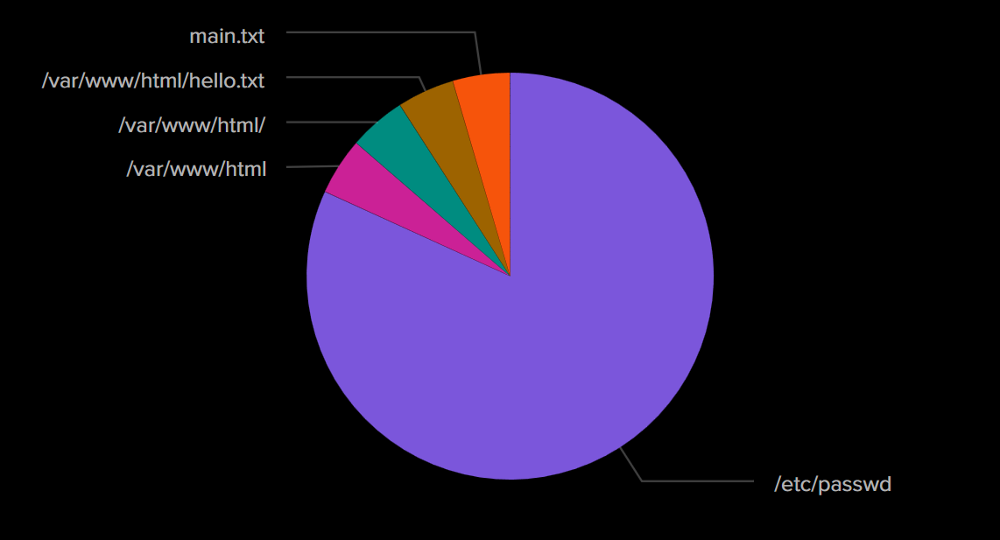

# Phase 2: Visual Analysis Using a SIEM Dashboard

In this phase, Splunk platform is utilized to collect and visualize data from both the victim and honeypot environments. This approach facilitates the identification and interpretation of malicious activities through graphical representations and log analysis.

---

## Our Case: ProFTPD Command Execution Exploit

### Log Integration and Session Monitoring

Logs from the victim machine running the vulnerable ProFTPD service were integrated into the SIEM. The primary focus was on monitoring session activity and identifying unauthorized file access through exploitation techniques involving `mod_copy`.

#### FTP Session Activity

*Figure 1: Log entries showing FTP session initiation and termination events.*

---

### Visualization of Exploit Impact

To provide a clearer understanding of the attacker’s actions, file access events were visualized using a pie chart. This representation highlights the scope and nature of accessed data during the exploitation window.
auditd tool is used here to capture the access logs.
#### File Access Distribution

*Figure 2: Distribution of accessed files captured during the attack.*

---

## Observations and Analysis

- The attacker successfully established and terminated FTP sessions, indicating active exploitation.
- The accessed file data suggests targeted interactions with the file system, potentially aiming for command execution or data exfiltration.
- Log correlations within the SIEM platform provided temporal and contextual alignment between session events and file access.
